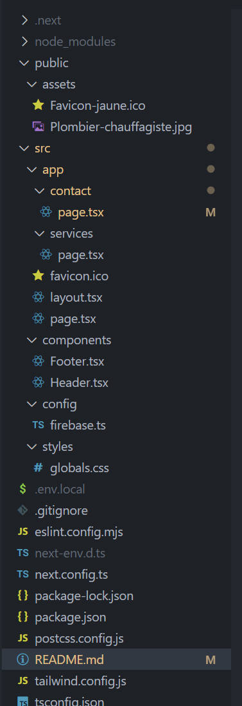

# Plombier Chauffagiste - Gestion des interventions

## 📌 Description du projet
Ce projet est un site web pour un **plombier chauffagiste**, permettant la gestion des interventions, des prises de rendez-vous et de la facturation en ligne. Il est **Mobile First** afin de faciliter l'utilisation par les techniciens sur le terrain.

## 🚀 Technologies utilisées
- **Next.js** (App Router)
- **TypeScript**
- **Tailwind CSS**
- **Firebase** (pour la gestion des données)
- **EmailJS** (pour les notifications par email)
- **ESLint & Prettier** (pour la qualité du code)

## ✅ Fonctionnalités réalisées

### 📝 Formulaire de Contact
- [x] Validation en temps réel des champs
- [x] Format de téléphone international (+33)
- [x] Sélection de date avec minimum J+1
- [x] Choix de créneaux horaires prédefinis

### 🧾 Gestion des Factures
- [x] Liste des factures avec filtres
- [x] Création de nouvelles factures
- [x] Aperçu des factures en temps réel
- [x] Calcul automatique des totaux (HT, TVA, TTC)
- [x] Interface intuitive pour ajouter/modifier les lignes

### 📦 Gestion des Articles
- [x] Organisation par familles d'articles
- [x] Gestion des coefficients de marge
- [x] Navigation dédiée Articles/Familles
- [x] Interface de gestion des familles

### 🔔 Notifications
- [x] Modal d'alerte personnalisé pour les rendez-vous urgents (<48h)
- [x] Messages de confirmation avec disparition automatique (5s)
- [x] Validation visuelle des champs en temps réel
- [x] Animation du chargement pendant l'envoi

### 📧 Emails Automatiques
- [x] Email de confirmation au client
- [x] Email de notification à l'administrateur
- [x] Formatage des dates en format européen (jj.mm.aaaa)
- [x] Inclusion des créneaux horaires

### 💾 Base de données
- [x] Stockage Firebase Firestore
- [x] Enregistrement horodaté des rendez-vous
- [x] Structure de données optimisée pour les factures et articles

## 📂 Structure du projet



plombier-site/ ├── src/ │ ├── app/ │ │ ├── contact/ # Formulaire de rendez-vous │ │ ├── factures/ # Gestion des factures │ │ ├── articles/ # Gestion des articles │ │ └── familles/ # Gestion des familles d'articles │ ├── components/ # Composants réutilisables │ │ └── navigation/ # Composants de navigation │ ├── styles/ # Fichiers CSS globaux │ └── config/ # Configuration Firebase ├── public/ # Fichiers statiques └── .env.local # Variables d'environnement

## 🔧 Installation et démarrage
1. **Cloner le projet**
   ```bash
   git clone URL_DU_REPO
   cd plombier-site
   ```

2. **Configuration des variables d'environnement**
   Créer un fichier `.env.local` avec :
   ```bash
   # Firebase Config
   NEXT_PUBLIC_FIREBASE_API_KEY=your_key
   NEXT_PUBLIC_FIREBASE_AUTH_DOMAIN=your_domain
   NEXT_PUBLIC_FIREBASE_PROJECT_ID=your_project_id
   NEXT_PUBLIC_FIREBASE_STORAGE_BUCKET=your_bucket
   NEXT_PUBLIC_FIREBASE_MESSAGING_SENDER_ID=your_sender_id
   NEXT_PUBLIC_FIREBASE_APP_ID=your_app_id

   # EmailJS Config
   NEXT_PUBLIC_EMAILJS_SERVICE_ID=your_service_id
   NEXT_PUBLIC_EMAILJS_TEMPLATE_ID_ADMIN=your_admin_template
   NEXT_PUBLIC_EMAILJS_TEMPLATE_ID_CLIENT=your_client_template
   NEXT_PUBLIC_EMAILJS_PUBLIC_KEY=your_public_key
   ```

3. **Installer les dépendances**
   ```bash
   npm install
   ```

4. **Lancer le serveur de développement**
   ```bash
   npm run dev
   ```

## 📋 Fonctionnalités à venir
- [ ] 📧 **Envoi des factures par email**
- [ ] 💳 **Paiement en ligne via Stripe**
- [ ] 🔔 **Rappels automatiques pour les entretiens annuels**
- [ ] 📊 **Tableau de bord avec statistiques**
- [ ] 📱 **Application mobile pour les techniciens**

## 🛠 Déploiement
- **Déploiement prévu sur Ionos**
- **Base de données : Firebase Firestore**

## 📜 Licence
Ce projet est sous licence **MIT**.

---

🚀 *Développement en cours - Version 1.2.0*